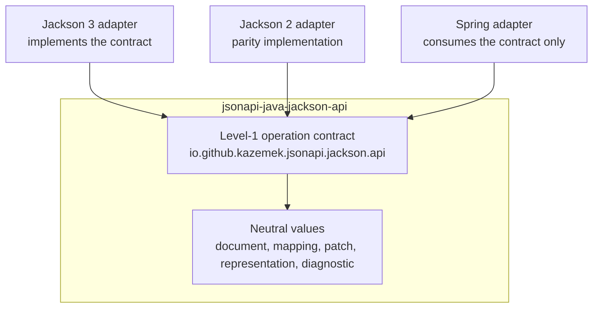

# ADR-019: Major-Neutral Level-1 Application API Contract

**Status:** Accepted
**Date:** 2026-09-04
**Amended:** 2026-09-05 (Context list syncs the low-level PATCH capability name to
`JsonApiPatchCommandReader`; no decision text changed)

## Context

The public Jackson surface is capability-oriented: `JsonApiDocumentReader`,
`JsonApiDocumentWriter`, `JsonApiResourceMapper`, `JsonApiResourceBinder`,
`JsonApiDomainDocumentReader`, `JsonApiPatchCommandReader`, and `JsonApiPatchDtoReader`.
Those are useful advanced seams, but ordinary application code must understand and
coordinate internal pipeline phases (map, decorate, validate, write; decode, validate,
bind; select representation; supply validation context; project PATCH).

The intended Spring boundary is Jackson-major-neutral: Spring should depend on the
`jsonapi-java-jackson-api` contract artifact rather than Jackson 2/3 implementation
APIs. The historical `jackson-api` rule was effectively "values only". Evolving the
module to values plus a narrow application-operation contract is an architectural
change recorded here.

This ADR freezes the Level-1 contract semantics. No runtime is implemented here; a
Jackson 3 implementation follows separately, and a later Jackson 2 artifact provides
parity.

## Goals

- Define a small Jackson-major-neutral Level-1 application API in
  `jsonapi-java-jackson-api` that expresses JSON:API application semantics, not
  Jackson mechanics.
- Let ordinary application code perform common JSON:API operations without manually
  coordinating mapping, binding, envelope application, representation selection,
  validation context, codec operations, or PATCH projection.
- Keep the contract client/server-neutral and bidirectional; framework adapters
  select an operation-specific subset appropriate to their role.
- Freeze the established boundaries — configured-Jackson authority,
  additive decoration, id/lid distinction, ADR-018 (relationship data
  presence), and `CREATE_REQUEST` validation — into the Level-1 architecture.

## Non-goals

- Implementing Jackson 2 or Jackson 3 behavior in `jsonapi-java-jackson-api`.
- Introducing a lowest-common-denominator Jackson SPI: no neutral `ObjectMapper`,
  no neutral `JavaType`, no parser/generator, serializer/deserializer, or
  introspector abstractions, and no runtime major detection.
- Spring semantics: no Spring types, no controller/request-mapping/status-code
  concepts, no HTTP-method-oriented operation names, no server-only validation
  policy in the neutral contract.
- Deleting, internalizing, or broadly renaming the advanced capability APIs.
- Filter/sort/page semantics, persistence/repository behavior, relationship
  hydration, lazy loading, nested-create semantics, or an opt-in default
  `jsonapi.version` (the contract only reserves room for it).
- A second naming registry, facade-level field aliases, or JSON:API property-name
  overrides.

## Architecture

The contract lives in `io.github.kazemek.jsonapi.jackson.api` and is owned by
`jsonapi-java-jackson-api`. Jackson 3 (later Jackson 2) implements it in its adapter
module; Spring eventually depends only on this neutral contract.



The root is a small interface with cohesive facet accessors, not a flat class:

```java
public interface JsonApi {
  JsonApiResources resources();
  JsonApiRelationships relationships();
  JsonApiDocuments documents();
  JsonApiPatches patches();
}
```

Application-lifetime configuration (configured mapper, identifier conversion,
custom linkage mapping, representation policy defaults, resource decorators, and
later a default `jsonapi.version`) belongs to major-specific runtimes, never to
`JsonApi` itself. The future configured implementation is immutable.
Request/operation-scoped values — `RepresentationSelection`, document envelope,
expected update identity where operation-specific, per-write explicit
`JsonApiObject` — are method arguments, never application-lifetime configuration.

## Level 1 vs advanced APIs

Level 1 is ordinary application operations. Advanced APIs are explicit
mechanism/control and remain public in the major-specific adapters:

| Level 1 (this contract) | Advanced (unchanged, major-specific) |
|-------------------------|--------------------------------------|
| `JsonApi` root plus four facets | `JsonApiDocumentReader` / `JsonApiDocumentWriter` |
| Homogeneous `readOne` / `readMany` binding directly to a caller type | `JsonApiResourceMapper` / `JsonApiResourceBinder` |
| Single/collection writes with `ResourceWriteOptions` | `JavaType` overloads, declared-type mapping |
| Create/update authoring selecting core usage | Raw `JsonApiDocument` construction, explicit `DocumentUsage` selection |
| To-one/null/to-many linkage facet | Heterogeneous `JsonApiDomainDocument` + `ResourceTypeRegistry` binding |
| Typed `PatchPresence<T>` DTO binding as the conventional PATCH path | `PatchCommand<T>` generic/infrastructure projection, low-level contexts |

## Resource read contract

Reads are homogeneous and strict. `readOne` requires primary data that is exactly
one resource object; `readMany` requires a resource collection. Null, absent,
identifier, identifier-collection, collection-for-one, single-for-many, and error
document states are never silently coerced (including never treating one resource
or null as an empty/singleton collection). Incompatible primary-document shape is
a mapping-family failure (`JsonApiMappingException`); no facade-specific exception
type is introduced.

Homogeneous reads bind directly to the caller-supplied target type and never
require `ResourceTypeRegistry` or route through heterogeneous
`DomainData<Object>` plus unchecked casts. Targets are `Class<T>` for the common
case and `java.lang.reflect.Type` where generic target fidelity genuinely requires
it (mirroring the advanced `JavaType` overloads, which remain available for full
Jackson parameterization). Sources are `String` for convenience/client/tests and
`InputStream` for server/Spring integration; `byte[]`, parser/generator, and other
low-level forms remain advanced. Each semantic read is therefore at most a
2-by-2 source/target matrix, never an ad-hoc overload list.

### Typed document read decision

Level 1 provides an optional typed document result alongside the primary-only
`readOne` / `readMany` conveniences. `readOneDocument` returns
`ResourceDocument<T>` and `readManyDocument` returns
`ResourceCollectionDocument<T>`: the bound primary DTO(s) plus top-level `meta`,
`links`, `jsonapi`, and compound `included` state carried as validated core
`ResourceObject` values. The existing major-specific `JsonApiDomainDocument` is
not reused: it is a heterogeneous registry-bound envelope in the Jackson 3 adapter,
while the Level-1 result is homogeneous and registry-free. Included state may be
heterogeneous, so DTO binding of included resources stays advanced; the Level-1
envelope deliberately carries included resources unbound rather than promising a
registry-free way to resolve their Java types.

The typed result is narrowly scoped: it does not hydrate `included` resources into
relationship properties, it is returned only after complete document validation,
and it carries no error/additional-member payload, so no losslessness is claimed
for information it does not preserve. Generic typed-document envelopes stay
advanced; the Level-1 typed reads accept `Class<T>` only.

## Resource write contract

Ordinary writes coordinate the current pipeline internally: resource mapper,
configured decoration, mapped-document validation, and document writer. Callers
never orchestrate those phases manually.

- `writeOne` writes one resource; `writeMany` writes a resource collection.
- Representation behavior is preserved: `RepresentationSelection` (sparse
  fieldsets, compound inclusion) applied under the runtime's effective
  `RepresentationPolicy`, configured resource decoration, and the document
  envelope. Policy is application/runtime configuration owned by the major-specific
  runtime, never a per-write value: the options below carry no policy, so a default
  write always inherits the runtime policy instead of overriding it with a concrete
  default. Per-call policy overrides remain advanced.
- Document-level `links`, `meta`, and `jsonapi` travel through the neutral
  `ResourceWriteOptions` value, which composes the existing semantic values
  (`DocumentEnvelope` plus `RepresentationSelection`) instead of duplicating them. Convenience overloads without options select
  documented defaults; `OutputStream` overloads serve server/Spring emission while
  `String` overloads serve client/test convenience. Generic declared-type writes
  stay advanced via the `JavaType` overloads.
- Default-version compatibility: an absent per-write `jsonapi` member (null on the
  envelope) is distinct from an explicit per-write `JsonApiObject`, so a future
  application-lifetime default version can apply only when the caller supplied no
  explicit value. Explicit per-write values override future runtime defaults.
  That default itself is not implemented here.

## Create/update authoring

Level 1 provides convenient client-side JSON:API create/update document authoring
without manual DTO mapping, raw `JsonApiDocument` construction, explicit usage
selection, validator invocation, or writer orchestration.

- `writeCreateDocument` delegates to the authoritative core create-request contract
  by
  selecting `DocumentUsage.CREATE_REQUEST`: primary data is exactly one resource
  object, its `id` may be omitted under existing create semantics, `id` and `lid`
  stay independent, every relationship supplied on the primary resource must
  contain `data`, and null/single/empty-collection/non-empty-collection linkage
  remain valid. The facade reimplements none of these rules, does not narrow the
  core's existing document-wide create identity leniency, and never interprets
  `included` as nested create mutations.
- `writeUpdateDocument` reuses the existing `UPDATE_REQUEST` validation semantics.
  Where the caller has expected-identity context, it is supplied explicitly as a
  core `EndpointIdentity` argument (compared by the core validator); the contract
  is otherwise HTTP-route-unaware and introduces no endpoint/server route identity
  concepts of its own.

Both paths are JSON:API-semantic operations, usable by client and server code;
no method name encodes an HTTP verb.

## Relationship-linkage documents

`JsonApiRelationships` is a linkage-only facet covering both directions with no
domain DTO registration and no graph hydration:

- To-one: one `ResourceIdentifier`, plus explicit null linkage (read returns
  Java `null` for explicit `data: null`; write accepts Java `null` to emit it).
- To-many: a collection of `ResourceIdentifier`, including the empty collection.
- Strict shape: a to-one read never accepts a collection; a to-many read never
  accepts one identifier or null. Related-resource documents are out of scope for
  this facet.
- Top-level document members on linkage documents stay advanced via the documents
  facet; the linkage facet produces minimal linkage documents.

## PATCH

Typed presence-aware PATCH DTO binding is the conventional Level-1 path
(`readPatch` returning the caller's PATCH DTO whose patchable members are
`PatchPresence<T>`). `PatchCommand<T>` remains the explicit lower-level, generic,
and infrastructure projection (`readCommand`). The distinction is preserved, not
erased. Neither path depends on global resource-type registration, and PATCH
itself is not redesigned. `Type` overloads mirror the advanced `JavaType`
overloads (`Object` results for typed DTOs; `PatchCommand<?>` for commands, with a
local S1452 suppression recording why the wildcard is the honest declaration);
`bindPatch` / `bindCommand`
bind an already-validated `JsonApiDocument` without re-parsing or re-validating.

## Raw/general document facet

`JsonApiDocuments` covers operations that genuinely require raw JSON:API
documents. Where `DocumentReadContext` / `PrimaryDataKind` cannot be inferred,
the caller supplies the semantic context explicitly; the facade never guesses
ambiguous document shapes. Reads take `String` or `InputStream` plus an explicit
context; writes accept `JsonApiDocument` or provenance-carrying `MappedDocument`
and emit to `String` or `OutputStream`. Writes validate as response/other usage
only: raw create/update request writing stays advanced, while ordinary request
authoring uses `writeCreateDocument` / `writeUpdateDocument`, so no write path
guesses or smuggles a request usage.

## Naming authority (frozen)

JSON:API annotations define semantic roles and locations; configured Jackson
remains the sole authority for property naming, visibility, mix-ins, aliases,
naming strategies, and ordinary Java binding mechanics. The Level-1 API adds no
property-name overrides, facade-level field aliases, or second naming registry.

## Local identifiers (frozen)

`id` and `lid` are distinct JSON:API roles across resource reads, resource
writes, create/update authoring, relationship linkage, and typed document reads.
The Level-1 API never promotes `lid` to `id`, never falls back from a missing
`id` to `lid`, never silently collapses both identities, and never invents
persistence semantics.

## Relationship data presence (ADR-018 frozen)

Ordinary selected `@JsonApiRelationship` domain properties remain
linkage-oriented and serialize with a present `data` member. No relationship
state wrapper, relationship envelope, facade-level absent/null/single/collection
marker, or data-removing decorator is introduced. Links-only and meta-only
relationship representations remain advanced core/document-model functionality.
For flat reads, relationship `data` absent leaves the mapped linkage property
unbound under configured-Jackson missing-property semantics; explicit
`data: null` remains a distinct explicit-null input and stays a cardinality
error on to-many properties. The facade normalizes none of these states
differently.

## Error behavior

No facade-specific exception semantics are introduced. Callers observe the
existing families:

| Failure | Abstraction |
|---------|-------------|
| Malformed JSON / wire decode problems | `JsonApiDocumentReadException` (`MALFORMED_JSON` and related categories) |
| Document validation failure (reads: with rule code and location) | `JsonApiDocumentReadException`; direct validator/writer use keeps `JsonApiValidationException` |
| Binding failure | `JsonApiMappingException` with stable `MappingDiagnostic` and location |
| Incompatible primary-document shape for the operation | `JsonApiMappingException` (mapping family, no second shape-validation system) |

No single unified exception is promised; the architecture does not support one
cleanly.

## Jackson 2 parity

Every neutral type uses only JDK, JSpecify, core model/validation, and sibling
neutral contracts: `String`, `InputStream`/`OutputStream`, `Class<T>`,
`java.lang.reflect.Type`, `List`, core `ResourceIdentifier` / `JsonApiDocument` /
`EndpointIdentity` / `JsonApiObject` / `Meta` / `Links` / `ResourceObject`, and
neutral `DocumentEnvelope` / `DocumentReadContext` / `RepresentationSelection` /
`MappedDocument` / `PatchCommand` (`RepresentationPolicy` remains the neutral
application/runtime policy value consumed by major-specific runtimes). No signature requires Jackson 3-only mechanics, smuggles
`JavaType` or mapper assumptions into the neutral layer, or needs runtime major
detection. Jackson 2 can implement the same observable semantics later; Jackson 2
itself is not implemented here.

## Spring boundary

The contract is client/server-neutral and bidirectional: `readOne`/`readMany` and
single/collection writes are generic operations, not server endpoints. Spring
later chooses which operations are conventional for controller request/response
handling and supplies its configured mapper plus collaborators to the
major-specific runtime; no neutral method encodes Spring MVC, HTTP methods,
controller semantics, request mappings, status codes, or server-only validation
policy.

## Consequences

Positive:

- Ordinary callers perform common JSON:API operations through four cohesive
  facets instead of coordinating pipeline phases.
- Spring gains a major-neutral seam depending only on the contract artifact.
- Advanced capability APIs stay available for explicit mechanism/control with no
  behavior change.
- Frozen decisions (configured-Jackson authority, additive decoration, id/lid
  distinction, ADR-018, create-request validation) gain an explicit
  architectural home above the mechanics that implement them.

Tradeoffs:

- The neutral surface is intentionally inexpressive where inference would be
  unsafe: ambiguous documents, generic declared types, linkage top-level members,
  and heterogeneous binding stay on advanced paths by design.
- Overload matrices (source-by-target, value-by-options) are systematic but add
  interface surface; each cell exists for Spring/client duality, not convenience
  sprawl.
- Exact mapping diagnostics for Level-1 shape mismatches are left to the Jackson 3
  implementation within the mapping family; this ADR fixes the category,
  not the code.
