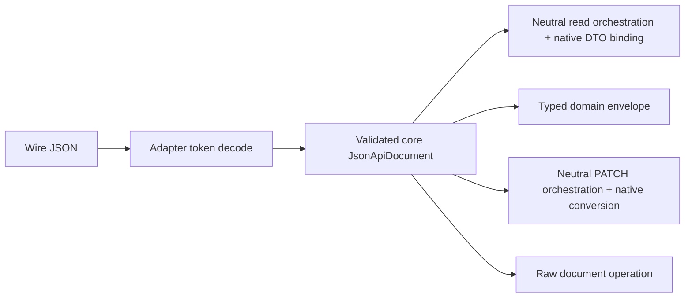
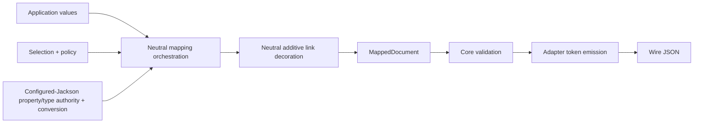

# Architecture

Current maintainer-facing mental model of the implemented JSON:API Java stack. This page describes
how the current modules compose; it is neither design history nor a proposal for a later redesign.

## Documentation ownership

| Surface | Owns |
|---------|------|
| Root [`README.md`](../README.md) | Repository overview, module registry, documentation navigation |
| This page | Current cross-module composition, flows, and authority boundaries |
| `<module>/README.md` | Current module capability, entry points, and module-local maintenance constraints |
| [`docs/adr/`](adr/README.md) | Consequential architectural rationale |
| [`docs/conformance.md`](conformance.md) | Current JSON:API feature support by layer |
| [`docs/vision.md`](vision.md) | Stable product direction, distinct from this snapshot |
| [`AGENTS.md`](../AGENTS.md) | Repository-wide task routing, knowledge ownership, and completion gates |
| [`.agents/skills/`](../.agents/skills/) | Workflow-specific contracts |

Package responsibilities live in `package-info.java`; public API semantics live in Javadoc; tests
provide behavioral proof.

## System boundary

The library represents, validates, reads, and writes JSON:API documents. Optional layers map
application values and parse query selections. Applications retain persistence, endpoints,
authorization, query execution, relationship mutation, and application of PATCH results.

## Modules and dependency direction

`settings.gradle.kts` is the build-membership authority. The implemented modules compose downward:

| Module | Owns | Production dependencies within the project |
|--------|------|--------------------------------------------|
| [`jsonapi-java-core`](../jsonapi-java-core/README.md) | Immutable wire model, local invariants, aggregate validation | None |
| [`jsonapi-java-annotations`](../jsonapi-java-annotations/README.md) | Dependency-free semantic mapping roles | None |
| [`jsonapi-java-api`](../jsonapi-java-api/README.md) | Backend-independent application, document, mapping, representation, diagnostic, and PATCH contracts currently implemented by configured Jackson | Core |
| [`jsonapi-java-mapping`](../jsonapi-java-mapping/README.md) | Internal cross-artifact mapping implementation namespace consumed by backend runtimes; owns backend-neutral compound-inclusion traversal, identity/order/limit policy, sparse-fieldset linkage exemptions, basic and advanced resource-write and resource-read orchestration, low-level `PatchCommand` orchestration, and neutral mapping-role/per-property naming metadata; published but unsupported consumer API | API |
| [`jsonapi-java-query`](../jsonapi-java-query/README.md) | Neutral query selection parsing and opaque parameter preservation | Core and neutral Jackson representation contracts |
| [`jsonapi-java-jackson3`](../jsonapi-java-jackson3/README.md) | Native Jackson 3 codec, mapping, binding, PATCH, and Level-1 runtime | Mapping, API, annotations, and core |
| [`jsonapi-java-jackson2`](../jsonapi-java-jackson2/README.md) | Native Jackson 2 codec, mapping, binding, PATCH, and Level-1 runtime | Mapping, API, annotations, and core |

The production dependency shape is a DAG: mapping depends on API, API depends on core, and each
backend depends on mapping while retaining its direct API, annotations, and core dependencies.

The two Jackson adapters share JSON:API mapping semantics, not Jackson mechanics. The neutral API
contains no production Jackson-major imports; `jsonapi-java-mapping` implements inclusion, resource
read/write and decoration, PATCH orchestration, and semantic property metadata behind narrow
unsupported backend capabilities. Each adapter remains the configured authority for property and
type discovery, names, construction, conversion, native diagnostics, and parser/generator behavior.
Its token-driven wire codec stays local to that Jackson major; there is no generic JSON tree/IR
codec, runtime-major detection, or supported Gson backend. This is a responsibility boundary, not a
lowest-common-denominator Jackson abstraction. [ADR-022](adr/022-responsibility-based-mapping-and-native-wire-codecs.md)
owns the rationale. Framework integrations, when added, depend on lower-layer public contracts; no
lower layer depends on a framework.

Within core, aggregate validation depends downward on the model, internal helpers, and validation
types; the model and internal helpers may depend on validation, but lower responsibilities do not
depend back on aggregate validation. Each Jackson adapter similarly keeps composition, mapping,
codec, and internal responsibilities directed. [ADR-007](adr/007-module-boundaries.md) owns the
module split and [ADR-009](adr/009-architectural-tests.md) owns its executable enforcement.

## Primary flows

Reads are document-first. Wire JSON is decoded through public core constructors and aggregate
validation before any application binding:

Flat binding is linkage-oriented and never injects `included` resources into relationships. Its
basic and advanced Core-to-application read orchestration — resource-type matching, strict and
independent identity-role selection, wire-member presence, attribute, relationship and meta order,
synthetic-input assembly preserving absent-versus-explicit-null, relationship cardinality
validation, null/empty short-circuiting, direct-identifier copying, `RelationshipLinkage`
occurrence pairing, resource/relationship meta binding, and the member-relative diagnostics — lives
once in `jsonapi-java-mapping` behind an adapter-supplied native bridge for configured
wire-identifier parsing, lazy relationship-shape resolution, configured linkage-mapper invocation,
and declared identifier-meta conversion; each adapter keeps declared meta-target validation,
effective deserialization property discovery, nested construction-path walking, native failure-path
extraction, and the single configured bean construction. The neutral read definition also owns the
top-level backend-name to JSON:API construction-start translation, while the effective native
property remains the adapter's authority. Typed-envelope document binding lives in
`jsonapi-java-mapping` behind an adapter-supplied native bridge for target-type construction,
configured resource-type name resolution, and per-resource binding; included resources bind
independently through explicit type registration, while each adapter keeps native per-resource
binding and meta conversion. Low-level `PatchCommand` orchestration lives in the same module behind
an adapter-supplied `PatchResourceBackend` bridge and shares the neutral relationship-linkage binder
with reads and typed PATCH DTOs; each adapter keeps declared meta-target validation against the
effective inbound PATCH property types, identity and attribute/meta conversion, final relationship
container coercion, and the native linkage operations. The neutral recursive structured-value engine and the typed `PatchPresence<T>`
DTO contract phase order also live in the same module, behind adapter-supplied
`StructuredShapeBackend` and `TypedPatchBackend` bridges; each adapter keeps configured shape
introspection and caching, wrapper-customization detection, property-scoped conversion,
construction-path translation, identity parsing, relationship conversion, and the single native
construction. PATCH projections do not read `included`.

Writes map application values into the core model, preserve representation provenance, validate,
then emit:

Mapped relationships produce linkage. Basic resource mapping — fieldset validation and filtering,
strict versus create identity, attributes, ordinary and advanced relationship linkage normalization,
relationship-member assembly, resource/relationship/identifier meta application, and additive
link decoration — lives in `jsonapi-java-mapping` behind an adapter-supplied native capability
bridge. Each adapter still validates declared meta targets, resolves the effective runtime type and
supplies the configured decoration registry, and owns configured conversion (including
property-scoped whole-meta and declared-type identifier-meta serialization), declared
relationship-shape and target resolution, and unresolved-target validation through narrow native
bridges. Compound inclusion
requires both operation-scoped selection and application-scoped policy; its backend-neutral
traversal lives in the same module behind another adapter-supplied native capability bridge.
Decoration only adds links to already mapped resources and relationships. Sparse-fieldset linkage
exemptions remain provenance on `MappedDocument`, which the writer composes into validation.
Callers do not translate mapping state into validation policy.

The neutral Level-1 `JsonApi` contract coordinates common resource, relationship, document, and
PATCH operations. Major-specific capability APIs remain public for explicit codec, mapping,
parameterized-type, heterogeneous-envelope, and policy control. [ADR-018](adr/018-level-one-application-api-contract.md)
owns that boundary.

## Authority boundaries

| Concern | Authority |
|---------|-----------|
| Document shape, member presence, explicit-null variants, linkage, identifier wire strings, and PATCH presence | JSON:API model and neutral library contracts |
| Local value invariants | Core model construction |
| Whole-document identity, linkage, operation usage, endpoint role, and occurrence rules | Core aggregate validation |
| JSON:API property roles and resource type | Mapping annotations |
| Normalized mapping role and per-property name metadata | `jsonapi-java-mapping` internal semantic metadata value |
| Java property discovery, visibility, external names, mix-ins, creators, serializers, deserializers, and conversion | Caller-configured Jackson |
| Include paths and fieldsets for one operation | `RepresentationSelection` |
| Allowed fields/includes and traversal limits | Application/runtime `RepresentationPolicy` |
| Basic resource write semantics: fieldset validation/filtering, strict versus create identity, empty-member omission, ordinary and advanced relationship linkage normalization, relationship-member assembly, resource/relationship/identifier meta application and overlay, and additive resource/relationship link decoration | `jsonapi-java-mapping` internal basic resource and decoration writers |
| Basic and advanced resource read semantics: resource-type matching, strict independent identity roles, wire-member presence, attribute/relationship/meta order, synthetic-input assembly preserving absent-versus-explicit-null, relationship cardinality validation, null/empty short-circuiting, direct-identifier copying, `RelationshipLinkage` occurrence pairing, resource/relationship meta binding, member-relative diagnostics, and top-level construction-start backend-name to JSON:API location translation | `jsonapi-java-mapping` internal resource reader |
| Low-level `PatchCommand` semantics: resource-type matching, required `id` identity that never falls back to `lid`, supplied-member classification, effective-deserialization bindability enforcement, `PatchChange` construction, `PatchCommand` assembly, and the contract phase order, sharing whole-linkage replacement and the relationship-linkage orchestration with the reader | `jsonapi-java-mapping` internal PATCH command binder |
| Recursive structured PATCH semantics (typed marker-tree assembly, low-level supplied-only `StructuredPatch` assembly, presence/null/empty distinctions, strict typed versus skip low-level unknown-member policy, and pointer accumulation) and typed `PatchPresence<T>` DTO phase order with presence-marker assembly, declaration preflight, and meta/data gating | `jsonapi-java-mapping` internal structured and typed PATCH binders |
| Configured wire-identifier parsing, lazy read relationship-shape resolution (target/type resolution and mapper selection), configured linkage-mapper invocation, declared identifier-meta conversion, declared meta-target validation, effective deserialization property discovery, nested construction-path walking, native failure-path extraction, and final bean construction | Each backend's read orchestration |
| Declared meta-target validation against the effective inbound PATCH property types, identity and attribute/meta conversion, configured structured-shape introspection and caching, wrapper-customization detection, native atomic conversion, final relationship container coercion, typed relationship conversion, construction-path translation, and final bean construction | Each backend's PATCH orchestration |
| Configured conversion (whole-meta and declared-type identifier-meta serialization), effective-type resolution, declared relationship-shape and target resolution, declared meta-target validation, and unresolved-target validation | Each backend's write orchestration |
| Compound-inclusion traversal order, identity aliasing, deduplication, and limits | `jsonapi-java-mapping` internal engine |
| Persistence, authorization, HTTP behavior, query execution, and applying updates | Application |

Adapters are constructed from configured mapper instances and never mutate the caller's mapper.
They may derive isolated internal mappers when a capability requires adapter modules or separate
introspection state; that does not create another public construction model. See
[ADR-004](adr/004-jackson-integration.md) and
[ADR-015](adr/015-jackson-adapter-construction.md).

Ordinary mapped relationships always carry `data`; links-only and meta-only forms remain available
through the core/document path. Resource meta, relationship meta, and identifier meta remain distinct
locations. Identifier meta uses opt-in `RelationshipLinkage<T, M>` and changes only with whole-linkage
replacement. See [ADR-014](adr/014-flat-whole-object-meta-mapping.md),
[ADR-016](adr/016-resource-identifier-meta-mapping.md), and
[ADR-017](adr/017-relationship-data-presence-in-domain-mapping.md).

Low-level `PatchCommand` and typed `PatchPresence<T>` DTOs are two projections of a validated update
document. Backend-neutral low-level command orchestration, recursive structured-value binding, and
the typed DTO contract phase order live in `jsonapi-java-mapping` behind each adapter's
`PatchResourceBackend`, `StructuredShapeBackend`, and `TypedPatchBackend` bridges; the typed DTO
projection itself remains the adapter's serialization-oriented mapping, while native identity
parsing, relationship conversion, configured shape introspection, and the single bean construction
stay adapter-owned. Both paths preserve omission versus explicit null; applications authorize and
apply the result. Recursive structured changes and atomic-container boundaries are owned by
[ADR-013](adr/013-recursive-structured-value-patch-semantics.md).

## Diagnostics

The three public failure families remain distinct:

| Family | Type | Scope |
|--------|------|-------|
| Core validation | `JsonApiValidationException` | Direct construction/validation and validated writes; rule code plus pointer |
| Document read | `JsonApiDocumentReadException` | Decode or read-time validation; category, safe source location, pointer, and validation rule when applicable |
| Mapping | `JsonApiMappingException` | Mapping, binding, registries, representation requests, and PATCH projection; diagnostic plus optional pointer |

Mapping pointers are resource-relative until a document-level operation composes them under `/data`
or `/included`. Failures without a meaningful member coordinate have no location; an empty string is
not used as a synthetic location. Public exception Javadocs own exact contracts.

## Enforcement

ArchUnit specifications protect module allowlists, Jackson-major isolation, supported-neutral versus
internal packages, core and adapter package DAGs, and the passive shared-fixture boundary. The build
also enforces formatting, compilation, tests, and coverage. Exact rules live with the modules they
protect; changes to the protected architecture require [ADR-009](adr/009-architectural-tests.md) to
change with them.

Current JSON:API support and draft-schema caveats are tracked in
[`docs/conformance.md`](conformance.md).
