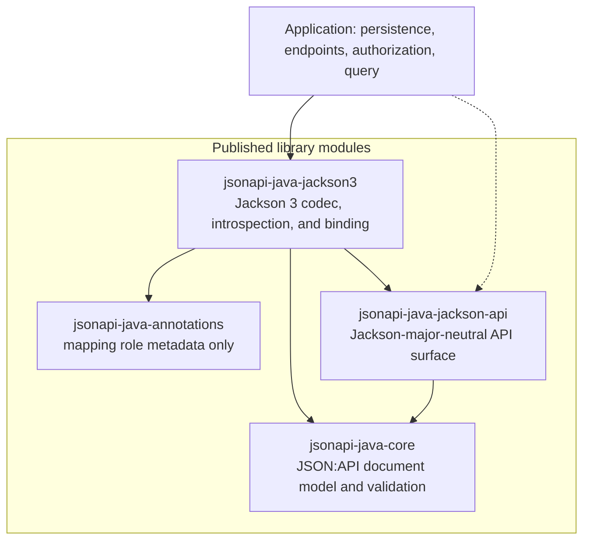
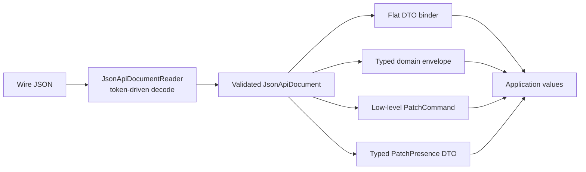
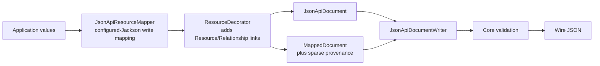
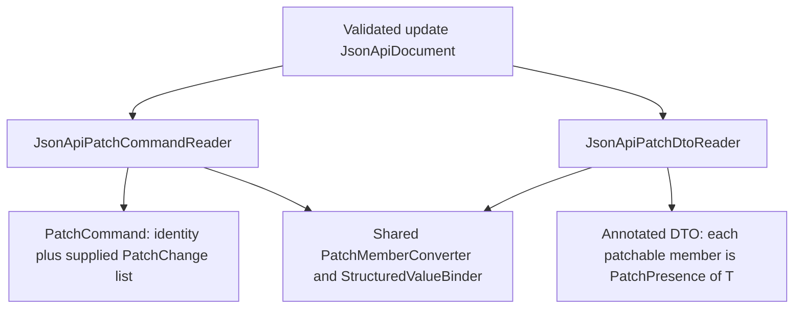
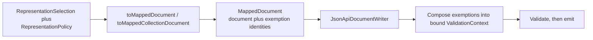
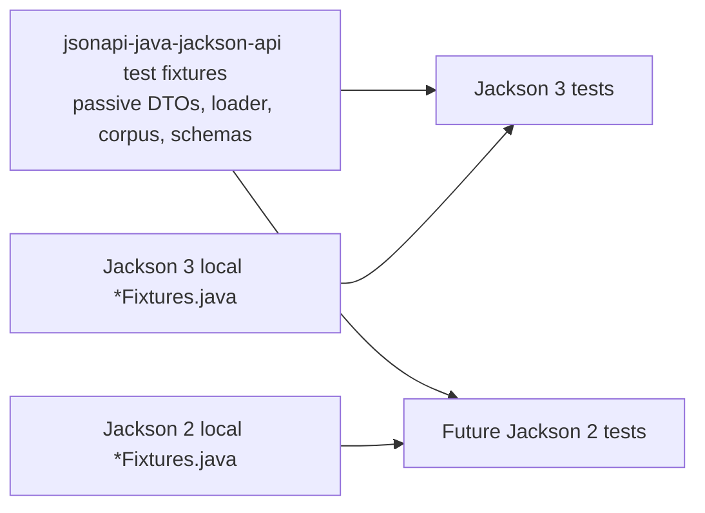

# Architecture

Current maintainer-facing mental model of the implemented JSON:API Java stack. This page describes
the architecture as it exists after the pre-Jackson-2 stabilization work. It is not a history of
how the design evolved, and it is not a proposal for a later redesign.

Detailed contracts live in module READMEs, public Javadoc, and accepted ADRs. This document
explains how those pieces fit together.

## Documentation ownership

| Surface | Owns |
|---------|------|
| Root [`README.md`](../README.md) | Project overview, module registry, entry points |
| This page | Cross-module mental model and flows |
| `<module>/README.md` | Module ownership, usage, local contributor guidance |
| [`docs/adr/`](adr/README.md) | Consequential, hard-to-reverse *why* decisions |
| [`docs/conformance.md`](conformance.md) | Current JSON:API 1.1 feature support |
| [`docs/vision.md`](vision.md) | Stable product direction, distinct from this snapshot |

## Module responsibilities

These are ownership boundaries, not a complete Gradle dependency graph. Jackson 2 is planned and
consumes the same `jackson-api` contracts; it is not an implemented module today.

The dotted application-to-`COMMON` edge is the Level-1 contract direction: Spring and
other framework adapters consume the neutral `JsonApi` operation contract and receive
a major-specific implementation, rather than depending on major-specific capability
APIs directly. [ADR-019](adr/019-level-one-application-api-contract.md) owns that seam.

Shared test fixtures live in the Jackson API `java-test-fixtures` source set as passive DTOs and canonical JSON/schema resources. The sole executable fixture type, `TestFixtureResources`, only provides neutral classpath access to those resources.

| Module | Responsibility |
|--------|----------------|
| [`jsonapi-java-core`](../jsonapi-java-core/README.md) | Immutable JSON:API document model and aggregate validation. No Jackson. |
| [`jsonapi-java-annotations`](../jsonapi-java-annotations/README.md) | Dependency-free mapping-role metadata. No codecs or converters. |
| [`jsonapi-java-jackson-api`](../jsonapi-java-jackson-api/README.md) | Public Jackson-major-neutral API surface: document, mapping, PATCH, representation, and diagnostic contracts shared by Jackson majors; the Level-1 application operation contract (`JsonApi` root plus resources, relationships, documents, and patches facets); passive carriers and shared JSON/schema test fixtures. |
| [`jsonapi-java-jackson3`](../jsonapi-java-jackson3/README.md) | Jackson 3 factories, token-driven codecs, configured-Jackson introspection, and domain/PATCH binding, plus the configured `Jackson3JsonApi` runtime implementing the Level-1 contract (via `JsonApiJackson3.jsonApi`/`builder`). |
| Application code | Persistence, HTTP, authorization, query execution, and applying PATCH commands. |

[ADR-007](adr/007-module-boundaries.md) records why these modules exist.
[ADR-010](adr/010-architectural-tests.md) enforces the production dependency allowlists.

## Primary data flows

Reads are document-first: wire JSON becomes a validated core `JsonApiDocument` before any domain
or PATCH binding. Writes map application values to core model objects, then validate before
emission. [ADR-006](adr/006-read-boundary.md) and [ADR-011](adr/011-flat-dto-read-binding.md)
own those boundaries.

Decoration is additive: mapped resources (primary and compound `included`) are enriched with
`ResourceObject.links` and `Relationship.links` after normal mapping but before validation. It never
creates relationships, never affects inclusion traversal, and never resurrects fieldset-omitted
relationships.

Ordinary domain relationships are linkage-oriented: a selected mapped relationship always emits a
`data` member (explicit null, single, or collection), and a wire relationship whose `data` member is
absent binds no linkage on flat reads while its relationship meta still binds. Links-only and
meta-only relationships remain document-level concerns, preserved by the core model and the document
codec in both directions. [ADR-018](adr/018-relationship-data-presence-in-domain-mapping.md) owns
that boundary.

Public Jackson 3 entry points are created from `JsonApiJackson3`. Codec paths are
`JsonApiDocumentReader` / `JsonApiDocumentWriter`. Mapping paths are `JsonApiResourceMapper`
(write), `JsonApiResourceBinder` (flat read), `JsonApiDomainDocumentReader` (typed envelope),
`JsonApiPatchCommandReader`, and `JsonApiPatchDtoReader`.

## Level-1 application contract

The neutral `io.github.kazemek.jsonapi.jackson.api` package is the ordinary application
path above those capability seams. The `JsonApi` root exposes four facets — `JsonApiResources`
(strict homogeneous reads, single/collection writes, create/update authoring),
`JsonApiRelationships` (to-one/null/to-many linkage documents), `JsonApiDocuments`
(raw documents with explicit `DocumentReadContext`), and `JsonApiPatches` (conventional
typed `PatchPresence<T>` DTO binding plus explicit `PatchCommand<T>`) — with
`ResourceWriteOptions` (envelope plus representation selection; policy stays
runtime-owned),
`ResourceDocument<T>`, and `ResourceCollectionDocument<T>` as the only option/result
values. Ordinary callers never coordinate mapper, decorator, validator, writer, codec,
or PATCH projection phases manually; advanced capability APIs stay public for explicit
mechanism/control. [ADR-019](adr/019-level-one-application-api-contract.md) freezes the
full contract, including the frozen configured-Jackson, additive-decoration, id/lid,
ADR-018, and create-request boundaries
and the Jackson 2 parity argument. The Jackson 3 implementation is the configured
`Jackson3JsonApi` runtime in `jsonapi-java-jackson3`; Jackson 2 parity follows separately.

Convenience writes infer a root `JavaType` from the concrete runtime class. Directly parameterized
roots such as `Container<Thing>` use the overloads that accept a complete `JavaType`; that declared
type is retained through attributes, relationship targets, and compound inclusion. An
unparameterized generic root fails at the mapped member that needs the missing declaration rather
than guessing from runtime contents. See the Jackson 3 README and
[ADR-005](adr/005-domain-mapping-and-inclusion.md).

## Authority map

JSON:API representation and configured Jackson are both authoritative, in different places.

| Concern | Authority |
|---------|-----------|
| Document envelope, member presence, sealed explicit-null vs Java absence, identifier wire strings, relationship linkage, `PatchPresence` state | JSON:API / this library |
| Aggregate document rules (identity uniqueness, full linkage, update-request shape, endpoint identity) | `jsonapi-java-core` validation |
| JSON:API property roles (identifier, local identifier, attribute, relationship, resource meta, relationship meta) | JSON:API annotations. `@JsonApiId` maps only `id` and `@JsonApiLocalId` maps only `lid`; neither identity role falls back to the other. Unannotated Jackson-visible properties do not participate, except the conventional identifier whose configured Jackson external name is `id`. |
| `@JsonApiResource(type)` | Explicit JSON:API semantic data (the resource `type` member), not a Jackson property name. Class-level mix-ins still supply or override the annotation through configured Jackson introspection. |
| Property discovery, visibility, mix-ins, creators, serializers/deserializers, and external JSON:API member names | Configured Jackson |
| Ordinary attribute and resource/relationship-meta property serialization and deserialization; `RelationshipLinkage` identifier-meta conversion | Configured Jackson at the mapped property / wrapper meta `JavaType` |
| Bean construction, creators, naming, visibility, modules | Configured Jackson |
| `ResourceTypeRegistry` | Explicit wire-type → Java-target dispatch. It does not interpret annotations; registration keys come from the same configured-Jackson metadata authority, and a consuming domain reader re-checks every key against its own configured metadata at construction. |
| `ResourceDecorator` / `ResourceDecoration` / `RelationshipDecoration` | Application/runtime decoration that adds only `ResourceObject.links` and mapped `Relationship.links`. Keys are the mapped logical property name; configured Jackson still owns the final wire name. Decoration never replaces mapping semantics and never resurrects fieldset-omitted relationships. |

`MappingDefinitionCache` is the Jackson 3 source of class-level resource metadata and of the two
direction-specific mapping views:

- serialization-oriented `ResourceMapping` for writes and both PATCH binders;
- deserialization-oriented `ReadResourceMapping` for ordinary flat reads.

Those caches stay separate because they answer different questions. Write mapping must not be
relaxed to make read-only shapes bind, and read bindability follows Jackson's effective
deserialization model rather than getters. See [ADR-004](adr/004-jackson-integration.md) and the
Jackson 3 module README.

## PATCH projections

Low-level `PatchCommand` and typed `PatchPresence<T>` DTOs are two projections of the same
validated update document, not competing APIs. Both run validate-on-read with
`DocumentUsage.UPDATE_REQUEST`, bind only the primary resource object, and never read `included`.
Applications authorize and apply the result.

- **Low-level path:** supplied mapped members become `PatchChange` entries. Nested ordinary
  structured values can recurse into `StructuredPatch` supplied-only changes.
- **Typed path:** every patchable member is declared `PatchPresence<T>`. Nested recursion is
  opt-in through a presence-aware PATCH *shape* (every visible member is itself
  `PatchPresence<…>`).
- **Identifier meta:** `ResourceIdentifier.meta` is not independently patchable. Applications that
  need it opt into `RelationshipLinkage<T, M>` on the relationship property. Identifier meta rides on
  whole-linkage replacement (`RelationshipChange` values that carry `ResourceIdentifier` and/or
  `RelationshipLinkage`). ADR-014's atomic `List` / `Set` / array / `Map` boundary forbids
  element-addressed mutation of to-many linkage identifier meta.

[ADR-012](adr/012-resource-patch-binding.md), [ADR-013](adr/013-direct-typed-patch-dto-binding.md),
[ADR-014](adr/014-recursive-structured-value-patch-semantics.md), and
[ADR-017](adr/017-resource-identifier-meta-mapping.md) own the contracts.

## Diagnostics

Three exception families remain distinct. Do not collapse them.

| Family | Type | When | Coordinates |
|--------|------|------|-------------|
| Core validation | `JsonApiValidationException` | Direct validator use, including document writers after mapping | `ValidationRuleCode` + JSON Pointer-like path |
| Codec / read | `JsonApiDocumentReadException` | Token-driven document reading | `CodecFailureCategory`, JSON Pointer-like path, safe `SourceLocation`. `ruleCode()` is present when a core constructor (`LOCAL_VALIDATION`) or aggregate validator (`AGGREGATE_VALIDATION`) failed during read. |
| Mapping | `JsonApiMappingException` | Domain write, flat bind, envelope bind, PATCH bind, registry/fieldset/include specification | `MappingDiagnostic` + optional `MappingLocation` |

Mapping locations follow one coordinate contract:

- present locations are RFC 6901 JSON Pointers built through `MappingLocation`, with `~` and `/`
  escaped per segment;
- resource-object producers emit resource-relative pointers over JSON:API member names
  (`/type`, `/id`, `/attributes/…`, `/relationships/…/data`, meta locations);
- typed-envelope composition joins a resource-relative location under a document prefix
  (`/data`, `/data/<index>`, `/included/<index>`) structurally, never by string concatenation;
- failures with no meaningful member coordinate carry an absent location (`null`), never `""` or
  `/`.

`JsonApiMappingException` Javadoc is the canonical location contract.
[ADR-003](adr/003-validation-and-immutability.md) covers core validation construction.

## Sparse-fieldset provenance

Sparse fieldsets are mapping provenance, not a caller-owned validation switch.

`RepresentationSelection` is per-operation input containing only requested include paths and sparse
fieldsets. `RepresentationPolicy` is application/configuration input containing include and field
permissions plus traversal/resource limits; it is not complete authorization. Jackson adapters
compose those values once into their internal effective representation. `MappedDocument` is the
distinct result/provenance value produced by one mapping operation. Applications may inspect a
selection when planning persistence projections, but this library defines and executes no projection
or persistence behavior.

- Fieldsets apply only on the `MappedDocument` mapping overloads. The unmapped `toDocument` /
  `toCollectionDocument` overloads reject a non-empty fieldset map.
- Exemptions name included resources whose inbound linkage an applied fieldset removed.
- The writer composes those identities into its bound `ValidationContext` before validation.
  Callers do not translate mapping provenance into validation policy.
- Relaxation is per exempted resource identity, not document-wide: unrelated full-linkage defects
  still fail.

[ADR-005](adr/005-domain-mapping-and-inclusion.md) separates linkage from inclusion. The Jackson 3
README records the writer-boundary contract.

## Jackson-major boundary

`jsonapi-java-jackson-api` stays free of `tools.jackson.*` and `com.fasterxml.jackson.*`.
Jackson 3 (and later Jackson 2) own major-specific factories, parsers, serializers, introspection,
and mapper derivation. There is no runtime major detection and no lowest-common-denominator
Jackson abstraction.

Adapter construction is mapper-instance based: a fully configured mapper plus the capability's
policy/context and required collaborators. Convenience factories choose documented defaults and
delegate. Capabilities do not mutate the caller's mapper.

Mapper *use* vs *derivation* is capability-specific:

| Capability | Mapper handling |
|------------|-----------------|
| Document reader | Uses the supplied mapper directly for token-driven parsing |
| Typed domain document reader | Uses the supplied mapper for document decode; derives an isolated binder mapper and registers the internal `MetaBindingModule` |
| Presence-aware PATCH reader | Uses the supplied mapper for document decode; derives an isolated binder mapper and registers the internal `MetaBindingModule` |
| Typed PATCH DTO reader | Uses the supplied mapper for document decode; derives an isolated binder mapper and registers the internal `MetaBindingModule` and `PatchPresence` modules |
| Document writer | Derives a mapper and registers the JSON:API document module |
| Resource mapper / flat binder | Derive isolated mappers for introspection and conversion; register the internal `MetaBindingModule` |

[ADR-016](adr/016-jackson-adapter-construction.md) is the construction policy.

## Test fixtures

Shared test fixtures contain passive DTOs and canonical JSON/schema resources, plus the neutral
`TestFixtureResources` classpath loader. Behavioral assertions belong in each adapter's own tests.

Do not introduce shared test orchestration, scenario registries, or assertion frameworks.

## Terminology

These names are adjacent and easy to conflate. They are not synonyms.

| Term | Meaning |
|------|---------|
| Presence-aware PATCH | The update contract that distinguishes omitted members, explicit JSON `null`, and supplied values. |
| Local identifier (`lid`) | JSON:API protocol member identifying a resource only within its document (for example client-generated identifiers in creation requests). Distinct from `id` and from application/database identity; mapped only by `@JsonApiLocalId` and never promoted to or from `id`. |
| Presence-aware nested PATCH shape | Typed-path declaration: every visible member of a nested type is `PatchPresence<…>`. Ordinary beans on the low-level path are not this. |
| `PatchCommand` | Low-level projection: identity plus a list of supplied `PatchChange`s. |
| `PatchPresence<T>` | Typed DTO member projection of the same tri-state. |
| `JsonApiDocument` | Validated core wire document. |
| `RepresentationSelection` | Per-operation request for JSON:API wire-name include paths and sparse fieldsets. |
| `RepresentationPolicy` | Application/configuration include and field permissions plus traversal/resource limits; not complete authorization. |
| `MappedDocument` | Core document plus sparse-fieldset linkage-exemption provenance from one mapping call. |
| `ResourceMapping` | Serialization-oriented write/PATCH metadata. |
| `ReadResourceMapping` | Deserialization-oriented flat-read metadata. |
| `ResourceTypeRegistry` | Wire JSON:API type → Java target dispatch, not a second annotation interpreter. |

## Further reading

- [jsonapi-java-core](../jsonapi-java-core/README.md)
- [jsonapi-java-annotations](../jsonapi-java-annotations/README.md)
- [jsonapi-java-jackson-api](../jsonapi-java-jackson-api/README.md)
- [jsonapi-java-jackson3](../jsonapi-java-jackson3/README.md)
- [ADR index](adr/README.md)
- [Conformance](conformance.md)
- [Vision](vision.md)
