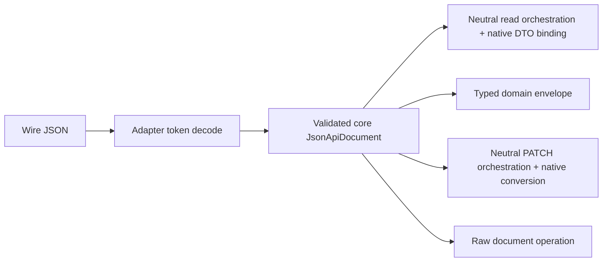
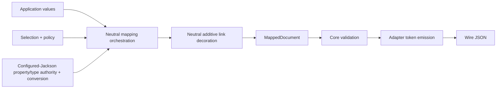

# Architecture

Current maintainer-facing mental model of the implemented JSON:API Java stack. This page describes
how the current modules compose; it is neither design history nor a proposal for a later redesign.

## Documentation ownership

| Surface | Owns |
|---------|------|
| Root [`README.md`](../README.md) | Public repository landing page and current module inventory |
| This page | Current cross-module composition, flows, and authority boundaries |
| [`site/`](site/) | Canonical user guide: installation and task-oriented examples |
| `<module>/README.md` | Module ownership, entry points, and module-local maintenance constraints |
| [`docs/adr/`](adr/README.md) | Consequential architectural rationale |
| [`docs/conformance.md`](conformance.md) | Current JSON:API feature support by layer |
| [`docs/vision.md`](vision.md) | Stable product direction, distinct from this snapshot |
| [`AGENTS.md`](../AGENTS.md) | Repository-wide task routing, knowledge ownership, and completion gates |
| [`.agents/skills/`](../.agents/skills/) | Workflow-specific contracts |

Package responsibilities live in `package-info.java`; public API semantics live in Javadoc; tests
provide behavioral proof.

## System boundary

The library represents, validates, reads, and writes JSON:API documents. Optional layers map
application values and parse query selections. Applications retain persistence, endpoints,
authorization, query execution, relationship mutation, and application of PATCH results.

## Public API ownership

The supported consumer API is the documented consumer-facing surface under `com.kazforge.jsonapi`,
including intended public/protected extension points. Module READMEs identify that surface; package
documentation and Javadoc own its responsibilities and contracts. Java visibility or artifact
publication alone does not imply consumer support. Packages beneath an `internal` segment and the
entire `jsonapi-java-mapping` artifact are unsupported implementation detail.

Normal API review assesses source and binary compatibility and documented observable behavior.
Internal changes have no separate compatibility promise, but changes to supported behavior still
require normal classification. Raising a supported runtime/dependency minimum or withdrawing a
supported line requires an explicit maintainer decision and is breaking;
[ADR-014](adr/014-unified-release-train.md) owns version and deprecation rules. This policy relies on
documented boundaries and review, not a bespoke signature-compatibility mechanism.

Java 21 is the runtime and build minimum. CI deliberately exercises a newer LTS without
automatically raising that minimum. Jackson 2 and Jackson 3 are separate supported dependency lines;
the [Jackson 2](../jsonapi-java-jackson2/README.md#jackson-support) and
[Jackson 3](../jsonapi-java-jackson3/README.md#jackson-support) adapter READMEs own their concrete
minimums and sustainable LTS baselines.

Production compilation, the default build, and published Jackson dependency declarations use those
minimums. Separate [version-catalog references](../gradle/libs.versions.toml) supply
Renovate-maintained current-test versions for test classpaths only. Advancing a current-test version
does not change published metadata or the support floor;
[dependency-baseline acceptance](release.md#dependency-baseline-acceptance) exercises each selection.

Consumer/framework dependency management may select newer compatible Jackson versions within the
appropriate major. Published dependencies use ordinary version declarations, without strict
constraints, forced versions, platforms, or version ranges. Baselines follow sustainable Jackson LTS
lines rather than older affected patches managed by Spring Boot. The future Spring integration owns
its tested Spring/Jackson compatibility matrix; adapter compatibility does not establish tested
Spring Boot integration.

## Modules and dependency direction

`settings.gradle.kts` is the build-membership authority. The implemented modules compose downward:

| Module | Owns | Production dependencies within the project |
|--------|------|--------------------------------------------|
| [`jsonapi-java-core`](../jsonapi-java-core/README.md) | Immutable wire model, local invariants, aggregate validation | None |
| [`jsonapi-java-annotations`](../jsonapi-java-annotations/README.md) | Dependency-free semantic mapping roles | None |
| [`jsonapi-java-api`](../jsonapi-java-api/README.md) | Backend-independent application, document, mapping, representation, diagnostic, and PATCH contracts currently implemented by configured Jackson | Core |
| [`jsonapi-java-mapping`](../jsonapi-java-mapping/README.md) | Backend-neutral mapping semantics consumed by the backend runtimes; published but unsupported consumer API | API |
| [`jsonapi-java-query`](../jsonapi-java-query/README.md) | Neutral query selection parsing and opaque parameter preservation | Core and neutral Jackson representation contracts |
| [`jsonapi-java-jackson3`](../jsonapi-java-jackson3/README.md) | Native Jackson 3 codec, mapping, binding, PATCH, and Level-1 runtime | Mapping, API, annotations, and core |
| [`jsonapi-java-jackson2`](../jsonapi-java-jackson2/README.md) | Native Jackson 2 codec, mapping, binding, PATCH, and Level-1 runtime | Mapping, API, annotations, and core |

The production dependency shape is a DAG: mapping depends on API, API depends on core, and each
backend depends on mapping while retaining its direct API, annotations, and core dependencies.

The two Jackson adapters share JSON:API mapping semantics, not Jackson mechanics. The neutral API
contains no production Jackson-major imports. `jsonapi-java-mapping` implements compound inclusion,
resource reads and writes, link decoration, typed envelopes, the Level-1 primary-data shape policy,
both PATCH projections, and mapping-definition invariants behind narrow unsupported backend
capabilities; its [package documentation](../jsonapi-java-mapping/src/main/java/com/kazforge/jsonapi/mapping/internal/package-info.java)
maps each area to the type that owns its contract. Each adapter remains the configured authority
for property and type discovery, names, construction, conversion, native diagnostics, and
parser/generator behavior. Its token-driven wire codec stays local to that Jackson major; there is
no generic JSON tree/IR codec, runtime-major detection, or supported Gson backend. This is a
responsibility boundary, not a lowest-common-denominator Jackson abstraction.
[ADR-015](adr/015-responsibility-based-mapping-and-native-wire-codecs.md) owns the rationale.
Framework integrations, when added, depend on lower-layer public contracts; no lower layer depends
on a framework.

Package direction inside core and each Jackson adapter is a module-local constraint stated in that
module's README. [ADR-007](adr/007-module-boundaries.md) owns the module split and
[ADR-009](adr/009-architectural-tests.md) owns its executable enforcement.

## Primary flows

Reads are document-first. Wire JSON is decoded through public core constructors and aggregate
validation before any application binding:

```mermaid
flowchart LR
  JSON["Wire JSON"] --> DECODE["Adapter token decode"]
  DECODE --> DOC["Validated core JsonApiDocument"]
  DOC --> FLAT["Neutral read orchestration + native DTO binding"]
  DOC --> ENVELOPE["Typed domain envelope"]
  DOC --> PATCH["Neutral PATCH orchestration + native conversion"]
  DOC --> RAW["Raw document operation"]
```

Flat binding is linkage-oriented and never injects `included` resources into relationships. Typed
envelopes bind included resources independently through explicit type registration, and PATCH
projections do not read `included`. For flat binding, typed envelopes, low-level `PatchCommand`,
and typed `PatchPresence<T>` DTOs alike, `jsonapi-java-mapping` owns the neutral orchestration,
phase order, and diagnostics. The adapter supplies configured property discovery, identifier
parsing, conversion, and the single native bean construction through a narrow capability bridge.

Writes map application values into the core model, preserve representation provenance, validate,
then emit:

```mermaid
flowchart LR
  APP["Application values"] --> MAP["Neutral mapping orchestration"]
  SELECT["Selection + policy"] --> MAP
  NATIVE["Configured-Jackson property/type authority + conversion"] --> MAP
  MAP --> DECORATE["Neutral additive link decoration"]
  DECORATE --> MAPPED["MappedDocument"]
  MAPPED --> VALIDATE["Core validation"]
  VALIDATE --> WRITE["Adapter token emission"]
  WRITE --> JSON["Wire JSON"]
```

Mapped relationships produce linkage. Resource-write orchestration, compound-inclusion traversal,
and additive link decoration live in `jsonapi-java-mapping` behind adapter-supplied capability
bridges; each adapter keeps configured conversion, effective-type resolution, and relationship
target resolution. Compound inclusion requires both operation-scoped selection and
application-scoped policy. Decoration only adds links to already mapped resources and
relationships. Sparse-fieldset linkage exemptions remain provenance on `MappedDocument`, which the
writer composes into validation. Callers do not translate mapping state into validation policy.

The neutral Level-1 `JsonApi` contract coordinates common resource, relationship, document, and
PATCH operations; the strict primary-data shape policy those operations apply lives in
`jsonapi-java-mapping`. Major-specific capability APIs remain public for explicit codec, mapping,
parameterized-type, heterogeneous-envelope, and policy control.
[ADR-012](adr/012-level-one-application-api-contract.md) owns that boundary.

## Authority boundaries

| Concern | Authority |
|---------|-----------|
| Document shape, member presence, explicit-null variants, linkage, identifier wire strings, and PATCH presence | JSON:API model and neutral library contracts |
| Local value invariants | Core model construction |
| Whole-document identity, linkage, operation usage, endpoint role, and occurrence rules | Core aggregate validation |
| JSON:API property roles and resource type | Mapping annotations |
| Java property discovery, visibility, external names, mix-ins, creators, serializers, deserializers, and conversion | Caller-configured Jackson |
| Include paths and fieldsets for one operation | `RepresentationSelection` |
| Allowed fields/includes and traversal limits | Application/runtime `RepresentationPolicy` |
| Backend-neutral mapping semantics, phase order, and diagnostics: compound inclusion, resource writes and reads, link decoration, typed envelopes, Level-1 primary-data shape, both PATCH projections, normalized roles and naming, and definition invariants | `jsonapi-java-mapping` internal orchestrators ([package map](../jsonapi-java-mapping/src/main/java/com/kazforge/jsonapi/mapping/internal/package-info.java)) |
| Native mechanics behind those semantics: identifier parsing, type and relationship-target resolution, linkage-mapper selection, declared meta-target validation, attribute, meta, and identifier conversion, structured-shape introspection, construction-path translation, and final bean construction | Each backend adapter |
| Persistence, authorization, HTTP behavior, query execution, and applying updates | Application |

Adapters are constructed from configured mapper instances and never mutate the caller's mapper.
They may derive isolated internal mappers when a capability requires adapter modules or separate
introspection state. See [ADR-004](adr/004-jackson-integration.md).

Ordinary mapped relationships always carry `data`; links-only and meta-only forms remain available
through the core/document path ([ADR-005](adr/005-domain-mapping-and-inclusion.md)). Resource meta,
relationship meta, and identifier meta remain distinct locations. Identifier meta uses opt-in
`RelationshipLinkage<T, M>` and changes only with whole-linkage replacement
([ADR-011](adr/011-flat-whole-object-meta-mapping.md)).

Low-level `PatchCommand` and typed `PatchPresence<T>` DTOs are two projections of a validated update
document. Both preserve omission versus explicit null; applications authorize and apply the result.
Recursive structured changes and atomic-container boundaries are owned by
[ADR-010](adr/010-resource-patch-binding.md).

## Diagnostics

The three public failure families remain distinct:

| Family | Type | Scope |
|--------|------|-------|
| Core validation | `JsonApiValidationException` | Direct construction/validation and validated writes; rule code plus pointer |
| Document read | `JsonApiDocumentReadException` | Decode or read-time validation; category, safe source location, pointer, and validation rule when applicable |
| Mapping | `JsonApiMappingException` | Mapping, binding, registries, representation requests, and PATCH projection; diagnostic plus optional pointer |

Mapping pointers are resource-relative until a document-level operation composes them under `/data`
or `/included`. Failures without a meaningful member coordinate have no location; an empty string is
not used as a synthetic location. Public exception Javadocs own exact contracts.

## Enforcement

ArchUnit specifications protect module allowlists, Jackson-major isolation, supported-neutral versus
internal packages, core and adapter package DAGs, and the passive shared-fixture boundary. The build
also enforces formatting, compilation, tests, and coverage. Exact rules live with the modules they
protect; changes to the protected architecture require [ADR-009](adr/009-architectural-tests.md) to
change with them.

`check` (and therefore `build`) enforces a fixed 80% JaCoCo line and branch coverage floor;
`jsonapi-java-annotations` is exempt because it has no executable coverage. The thresholds live only
in the [shared library convention](../build-logic/src/main/kotlin/jsonapi-java-library.gradle.kts),
not measured-value ratchets. `check` also validates consumer-facing Javadoc; `build` assembles each
module's Javadoc JAR. Standard contributor commands are in [CONTRIBUTING](../CONTRIBUTING.md).

Current JSON:API support and draft-schema caveats are tracked in
[`docs/conformance.md`](conformance.md).
